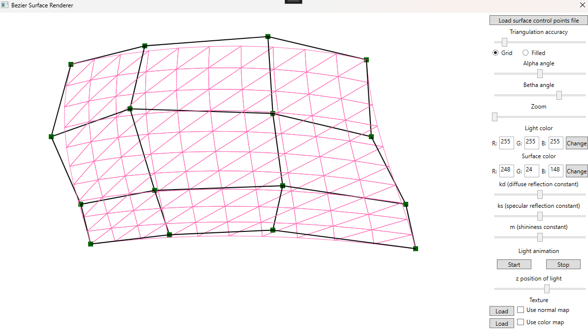
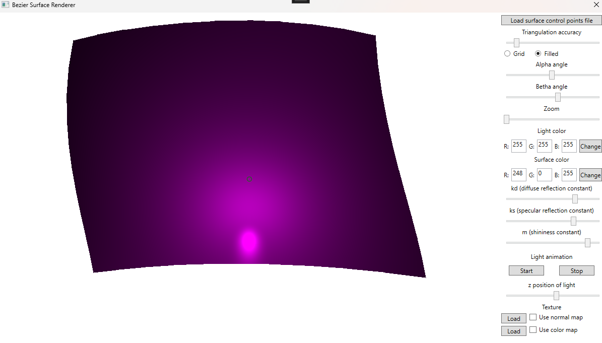
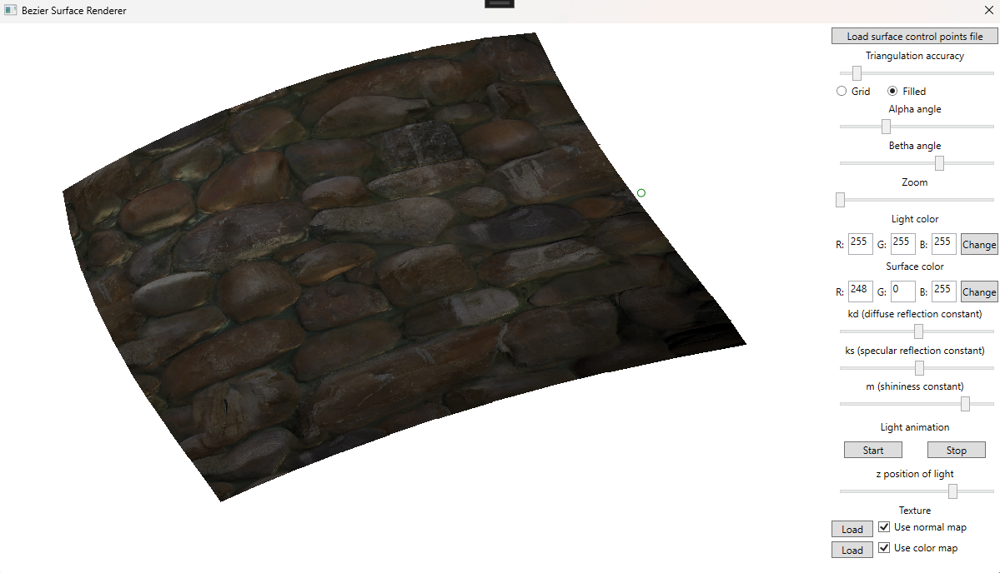

# ✨ Bezier Surface Renderer (WPF)

A desktop application written in **C# / WPF** that renders and visualizes a Bezier surface defined by a grid of control points. The program supports interactive manipulation, lighting effects, and advanced shading techniques.

## 🎓 Academic Context

Project created as part of the academic course **Computer Graphics** during the **2024/2025 winter semester** at **Warsaw University of Technology**.

## ✨ Features

* 📂 **Surface input**

  * Load **16 control points** (x, y, z) from a `.txt` file (space-separated, one per line).
  * Defines a **Bezier surface** of degree (3, 3).

* 🔺 **Triangulation**

  * Adjustable triangulation density with a **slider**.

* 🎛️ **Interactive controls**

  * 🔄 Rotate surface with **α (alpha)** and **β (beta)** sliders.
  * 🔍 Zoom in/out wireframe grid for better inspection using slider.

* 🖼️ **Rendering modes**

  1. 📏 **Wireframe grid** – visualize control mesh and triangulation.
  2. 🟦 **Solid surface** – shaded with per-pixel lighting.

* 💡 **Phong lighting model**

  * Configurable parameters:

    * 🔵 **kd** – diffuse reflection.
    * ⚪ **ks** – specular reflection.
    * ✨ **m (α)** – shininess factor.
  * 🎨 Editable **light color** and **surface color**.
  * 🎥 **Animated light source** – moving dynamically to showcase lighting.
  * ↕️ Manual control of **light Z position**.

* 🖌️ **Texture mapping**

  * 🌀 **Normal map** support for realistic shading.
  * 🌈 **Color texture map** projection onto the Bezier surface.

## 🎮 Controls

* 🎚️ **Sliders** – adjust triangulation, rotation (α, β), wireframe zoom, lighting parameters.
* 🔘 **Toggle buttons** – switch between wireframe, shaded, and textured modes.
* 🎨 **RGB values input** – control surface and light colors.
* ▶️ **Animation toggle** – enable or disable light movement.

## 🛠️ Technologies

* **C# / WPF**
* Custom **Bezier surface evaluation** (16 control points)
* **Phong illumination model** (per-pixel lighting)
* **Normal & color texture mapping**

## 🖼️ Preview

## 👤 Author

Developed by [Piotr Iśtok](https://github.com/p10tr13).

## 📜 License

This project is released under the MIT License.
